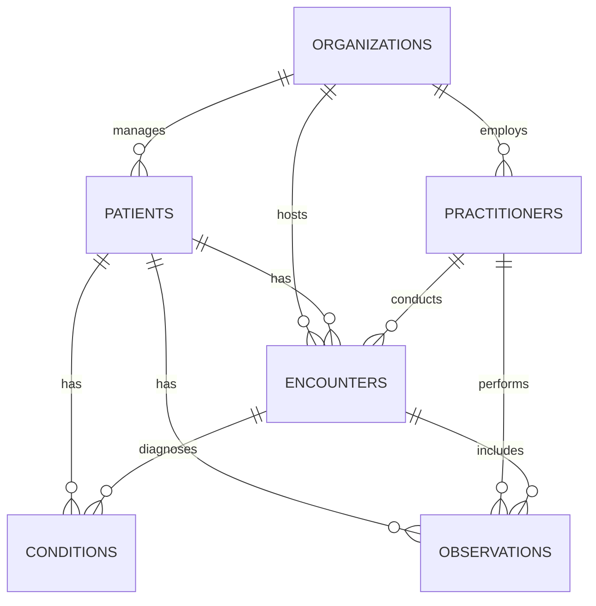

# 🏥 FastAPI Healthcare API

A comprehensive, production-ready FastAPI project for managing healthcare data using PostgreSQL and Docker. Built with clean architecture, comprehensive data modeling, and RESTful CRUD endpoints following FHIR (Fast Healthcare Interoperability Resources) standards.

---

## 📦 Features

- 🚀 **FastAPI v2** with modular structure and versioned APIs
- 🧠 **SQLAlchemy ORM** with PostgreSQL for robust data persistence
- 📄 **Pydantic schemas** for request/response validation
- 🐳 **Docker + docker-compose** for isolated development
- 🔁 **CRUD endpoints** for core FHIR-style entities
- 🔧 **Swagger UI** for interactive API testing
- 📊 **Comprehensive data modeling** with proper relationships
- 🏗️ **Clean architecture** with separation of concerns

---

## 🏗️ Project Structure

```text
Building API/
├── app/                    # Original API version
├── app_v2/                 # Enhanced API version with comprehensive modeling
│   ├── models/             # SQLAlchemy database models
│   ├── routes/             # API endpoint handlers
│   ├── schemas/            # Pydantic validation schemas
│   ├── database.py         # Database configuration
│   └── main.py             # FastAPI application entry point
├── scripts/                # Data import utilities
├── data/                   # FHIR bundle data files
├── mock_data/              # Sample data for testing
├── tests/                  # Test suite
└── docker-compose.yml      # Docker configuration
```

---

## 🗃️ Comprehensive Data Modeling (app_v2)

### **Database Schema Overview**

The app_v2 implements a comprehensive healthcare data model with 6 core entities and their relationships:

#### **Core Entities:**

1. **🏢 Organizations** (`organizations_v2`)
   - Healthcare facilities, hospitals, clinics
   - Manages practitioners and hosts encounters
   - Contains contact and location information

2. **👥 Patients** (`patients_v2`)
   - Central entity - all healthcare data revolves around patients
   - Comprehensive demographic and contact information
   - Links to managing organization

3. **👨‍⚕️ Practitioners** (`practitioners_v2`)
   - Healthcare providers (doctors, nurses, specialists)
   - Belongs to organizations
   - Conducts encounters and performs observations

4. **🏥 Encounters** (`encounters_v2`)
   - Patient visits, appointments, hospital stays
   - Links patients, practitioners, and organizations
   - Contains visit details, timing, and reasons

5. **🩺 Conditions** (`conditions_v2`)
   - Medical diagnoses, problems, conditions
   - Associated with patients and encounters
   - Includes clinical status and verification

6. **📊 Observations** (`observations_v2`)
   - Clinical measurements, test results, vital signs
   - Links to patients, encounters, and practitioners
   - Supports both numeric and text values

### **Database Relationships & Cardinality**



### **Key Design Principles:**

#### **1. Patient-Centric Design**
- **Patients** are the central entity
- All clinical data (encounters, conditions, observations) links back to patients
- Enables comprehensive patient history and care coordination

#### **2. Flexible Relationships**
- **Optional foreign keys** allow for incomplete data scenarios
- **Nullable relationships** support real-world healthcare workflows
- **One-to-many relationships** follow healthcare domain patterns

#### **3. FHIR Compliance**
- **FHIR-style identifiers** for interoperability
- **Standardized coding systems** (LOINC, SNOMED CT)
- **Temporal data** with proper datetime handling

#### **4. Data Integrity**
- **Primary keys** with auto-incrementing IDs
- **Foreign key constraints** for referential integrity
- **Indexes** on frequently queried fields

### **Detailed Entity Specifications**

#### **🏢 Organizations Table**
```sql
CREATE TABLE organizations_v2 (
    id SERIAL PRIMARY KEY,
    identifier VARCHAR UNIQUE,           -- FHIR identifier
    name VARCHAR NOT NULL,               -- Organization name
    type_code VARCHAR,                   -- Organization type (hospital, clinic, etc.)
    type_display VARCHAR,                -- Human-readable type
    phone VARCHAR,                       -- Contact phone
    email VARCHAR,                       -- Contact email
    address_line VARCHAR,                -- Street address
    city VARCHAR,                        -- City
    state VARCHAR,                       -- State/Province
    postal_code VARCHAR,                 -- ZIP/Postal code
    part_of_identifier VARCHAR           -- Parent organization
);
```

#### **👥 Patients Table**
```sql
CREATE TABLE patients_v2 (
    id SERIAL PRIMARY KEY,
    identifier VARCHAR UNIQUE,           -- MRN/UUID from FHIR
    first_name VARCHAR NOT NULL,         -- Patient first name
    last_name VARCHAR NOT NULL,          -- Patient last name
    birth_date DATE NOT NULL,            -- Date of birth
    gender VARCHAR,                      -- Gender (M/F/O)
    phone VARCHAR,                       -- Contact phone
    email VARCHAR,                       -- Contact email
    address_line VARCHAR,                -- Street address
    city VARCHAR,                        -- City
    state VARCHAR,                       -- State/Province
    postal_code VARCHAR,                 -- ZIP/Postal code
    marital_status VARCHAR,              -- Marital status
    language VARCHAR,                    -- Preferred language
    race VARCHAR,                        -- Race
    ethnicity VARCHAR,                   -- Ethnicity
    deceased_date VARCHAR,               -- Date of death (ISO string)
    active BOOLEAN DEFAULT TRUE,         -- Active patient flag
    managing_organization_identifier VARCHAR  -- Managing organization
);
```

#### **👨‍⚕️ Practitioners Table**
```sql
CREATE TABLE practitioners_v2 (
    id SERIAL PRIMARY KEY,
    identifier VARCHAR,                  -- FHIR identifier
    name VARCHAR NOT NULL,               -- Practitioner name
    gender VARCHAR,                      -- Gender
    specialty_code VARCHAR,              -- Medical specialty code
    specialty_display VARCHAR,           -- Specialty description
    phone VARCHAR,                       -- Contact phone
    email VARCHAR,                       -- Contact email
    organization_id INTEGER REFERENCES organizations_v2(id)  -- Employing organization
);
```

#### **🏥 Encounters Table**
```sql
CREATE TABLE encounters_v2 (
    id SERIAL PRIMARY KEY,
    patient_id INTEGER NOT NULL REFERENCES patients_v2(id),
    practitioner_id INTEGER REFERENCES practitioners_v2(id),
    organization_id INTEGER REFERENCES organizations_v2(id),
    
    identifier VARCHAR,                  -- Encounter identifier
    status VARCHAR NOT NULL,             -- Encounter status (planned, active, finished)
    class_code VARCHAR,                  -- Encounter class (ambulatory, emergency, etc.)
    class_display VARCHAR,               -- Human-readable class
    start_time TIMESTAMP,                -- Encounter start time
    end_time TIMESTAMP,                  -- Encounter end time
    reason_code VARCHAR,                 -- Reason for encounter
    reason_display VARCHAR               -- Human-readable reason
);
```

#### **🩺 Conditions Table**
```sql
CREATE TABLE conditions_v2 (
    id SERIAL PRIMARY KEY,
    patient_id INTEGER NOT NULL REFERENCES patients_v2(id),
    encounter_id INTEGER REFERENCES encounters_v2(id),
    
    code VARCHAR NOT NULL,               -- Condition code (ICD-10, SNOMED)
    system VARCHAR,                      -- Coding system
    display VARCHAR,                     -- Human-readable condition
    category_code VARCHAR,               -- Condition category
    clinical_status VARCHAR,             -- Clinical status (active, inactive, resolved)
    verification_status VARCHAR,         -- Verification status (provisional, confirmed)
    onset_time TIMESTAMP,                -- Condition onset time
    abatement_time TIMESTAMP,            -- Condition resolution time
    recorded_date TIMESTAMP              -- When condition was recorded
);
```

#### **📊 Observations Table**
```sql
CREATE TABLE observations_v2 (
    id SERIAL PRIMARY KEY,
    patient_id INTEGER NOT NULL REFERENCES patients_v2(id),
    encounter_id INTEGER REFERENCES encounters_v2(id),
    practitioner_id INTEGER REFERENCES practitioners_v2(id),
    
    identifier VARCHAR,                  -- Observation identifier
    status VARCHAR NOT NULL,             -- Observation status
    code VARCHAR NOT NULL,               -- Observation code (LOINC)
    code_system VARCHAR,                 -- Coding system
    code_display VARCHAR,                -- Human-readable observation
    value_quantity FLOAT,                -- Numeric value
    value_unit VARCHAR,                  -- Unit of measurement
    value_string VARCHAR,                -- Text value
    effective_time TIMESTAMP,            -- When observation was taken
    issued_time TIMESTAMP                -- When observation was recorded
);
```

---

## 🧪 API Documentation

### **API Versions**
- **v1**: `/api/v1/*` - Original implementation
- **v2**: `/api/v2/*` - Enhanced version with comprehensive data modeling

### **Interactive Documentation**
Once running, open http://localhost:8000/docs for the interactive Swagger UI.

### **Health Check**
```bash
GET /api/v2/health
Response: {"status": "ok", "api": "v2"}
```

### **Complete API Endpoints (v2) - IMPLEMENTED ✅**

#### **🏥 Patients**
```bash
GET    /api/v2/patients           # List patients with filtering
GET    /api/v2/patients/{id}      # Get patient by ID
POST   /api/v2/patients           # Create new patient
PUT    /api/v2/patients/{id}      # Update patient
DELETE /api/v2/patients/{id}      # Delete patient

# Query Parameters for GET /api/v2/patients:
# - limit, offset (pagination)
# - identifier, first_name, last_name, active (filtering)
```

#### **🏥 Encounters**
```bash
GET    /api/v2/encounters         # List encounters with patient-based filtering
GET    /api/v2/encounters/{id}    # Get encounter by ID
POST   /api/v2/encounters         # Create new encounter
PUT    /api/v2/encounters/{id}    # Update encounter
DELETE /api/v2/encounters/{id}    # Delete encounter

# Query Parameters for GET /api/v2/encounters:
# - patient_id (patient-based filtering)
# - practitioner_id, organization_id, status
# - start_from, start_to (date range)
# - class_code, limit, offset
```

#### **🩺 Conditions**
```bash
GET    /api/v2/conditions         # List conditions with patient-based filtering
GET    /api/v2/conditions/{id}    # Get condition by ID
POST   /api/v2/conditions         # Create new condition
PUT    /api/v2/conditions/{id}    # Update condition
DELETE /api/v2/conditions/{id}    # Delete condition

# Query Parameters for GET /api/v2/conditions:
# - patient_id (patient-based filtering)
# - encounter_id, code, clinical_status
# - verification_status, category_code
# - onset_from, onset_to (date range)
```

#### **🏢 Organizations**
```bash
GET    /api/v2/organizations      # List organizations with filtering
GET    /api/v2/organizations/{id} # Get organization by ID
POST   /api/v2/organizations      # Create new organization
PUT    /api/v2/organizations/{id} # Update organization
DELETE /api/v2/organizations/{id} # Delete organization

# Query Parameters for GET /api/v2/organizations:
# - name, type_code, city, state
# - identifier, limit, offset
```

#### **👨‍⚕️ Practitioners**
```bash
GET    /api/v2/practitioners      # List practitioners with organization-based filtering
GET    /api/v2/practitioners/{id} # Get practitioner by ID
POST   /api/v2/practitioners      # Create new practitioner
PUT    /api/v2/practitioners/{id} # Update practitioner
DELETE /api/v2/practitioners/{id} # Delete practitioner

# Query Parameters for GET /api/v2/practitioners:
# - organization_id (organization-based filtering)
# - name, specialty_code, gender
# - identifier, limit, offset
```

### **🔍 Advanced Filtering Examples**

#### **Patient-Based Filtering**
```bash
# Get all encounters for patient 123
GET /api/v2/encounters?patient_id=123

# Get all conditions for patient 123
GET /api/v2/conditions?patient_id=123

# Get active conditions for patient 123
GET /api/v2/conditions?patient_id=123&clinical_status=active

# Get encounters for patient 123 in date range
GET /api/v2/encounters?patient_id=123&start_from=2024-01-01&start_to=2024-12-31
```

#### **Organization-Based Filtering**
```bash
# Get all practitioners at organization 1
GET /api/v2/practitioners?organization_id=1

# Get all cardiologists at organization 1
GET /api/v2/practitioners?organization_id=1&specialty_code=cardiology

# Get all hospitals in New York
GET /api/v2/organizations?state=NY&type_code=hospital
```

#### **Cross-Entity Queries**
```bash
# Get practitioners named "Smith"
GET /api/v2/practitioners?name=Smith

# Get organizations with "City" in name
GET /api/v2/organizations?name=City

# Get completed encounters
GET /api/v2/encounters?status=completed

# Get confirmed conditions
GET /api/v2/conditions?verification_status=confirmed
```

---

## 🏗️ API Architecture & Features

### **✅ Implemented Features**

#### **1. Complete CRUD Operations**
- **Create**: POST endpoints for all entities
- **Read**: GET endpoints with filtering and pagination
- **Update**: PUT endpoints for partial updates
- **Delete**: DELETE endpoints with proper error handling

#### **2. Advanced Filtering System**
- **Patient-Based Filtering**: Get encounters and conditions for specific patients
- **Organization-Based Filtering**: Get practitioners at specific organizations
- **Date Range Filtering**: Filter by time periods (onset, start, end dates)
- **Status Filtering**: Filter by clinical status, verification status, encounter status
- **Text Search**: Partial matching on names, codes, and identifiers

#### **3. Pagination & Performance**
- **Limit/Offset Pagination**: Control result set size
- **Default Limits**: 20 items per page, max 100
- **Ordered Results**: Consistent sorting for better UX
- **Database Indexes**: Optimized queries on frequently filtered fields

#### **4. Data Validation & Error Handling**
- **Pydantic Schemas**: Request/response validation
- **HTTP Status Codes**: Proper REST status codes (200, 201, 204, 404)
- **Error Messages**: Clear, descriptive error responses
- **Input Validation**: Query parameter constraints and validation

#### **5. API Documentation**
- **Swagger UI**: Interactive API documentation at `/docs`
- **ReDoc**: Alternative documentation at `/redoc`
- **OpenAPI Schema**: Machine-readable API specification
- **Endpoint Descriptions**: Detailed documentation for each endpoint

### **🔗 API Relationships**

```
Patient (Central Entity)
├── Encounters (visits, appointments)
├── Conditions (diagnoses, problems)
└── Observations (measurements, test results)

Organization (Healthcare Facility)
├── Practitioners (doctors, nurses)
└── Encounters (hosted visits)

Practitioner (Healthcare Provider)
├── Encounters (conducted visits)
└── Observations (performed tests)
```

### **📊 Response Formats**

#### **List Endpoints**
```json
[
  {
    "id": 1,
    "patient_id": 123,
    "status": "completed",
    "start_time": "2024-01-15T10:00:00"
  }
]
```

#### **Single Item Endpoints**
```json
{
  "id": 1,
  "first_name": "John",
  "last_name": "Doe",
  "birth_date": "1990-05-15",
  "active": true
}
```

#### **Error Responses**
```json
{
  "detail": "Patient not found"
}
```

---

## 🗃️ Tech Stack

- **Backend Framework**: FastAPI 0.116.1
- **Database**: PostgreSQL with SQLAlchemy ORM
- **Data Validation**: Pydantic
- **Containerization**: Docker + Docker Compose
- **API Documentation**: Swagger UI (OpenAPI)
- **Development Server**: Uvicorn

---

## 🚀 Quick Start

### **Prerequisites**
- Docker and Docker Compose
- Python 3.11+ (for local development)

### **Using Docker (Recommended)**
```bash
# Clone the repository
git clone <your-repository-url>
cd your-project-directory

# Start the services
docker-compose up -d

# The API will be available at http://localhost:8000
# Swagger UI at http://localhost:8000/docs
```

### **Local Development**
```bash
# Create virtual environment
python -m venv venv
source venv/bin/activate  # On Windows: venv\Scripts\activate

# Install dependencies
pip install -r requirements.txt

# Set up database (if not already done)
python app_v2/create_tables_v2.py

# Run the application
uvicorn app_v2.main:app --reload

# The API will be available at http://localhost:8000
# Interactive docs at http://localhost:8000/docs
```

### **🚀 Quick API Testing**

#### **1. Start the Server**
```bash
# Navigate to your project directory
cd your-project-directory

# Activate virtual environment
source venv/bin/activate  # On Windows: venv\Scripts\activate

# Start the server
uvicorn app_v2.main:app --reload
```

#### **2. Open Interactive Documentation**
- **Swagger UI**: http://localhost:8000/docs
- **ReDoc**: http://localhost:8000/redoc

#### **3. Test Patient-Based Filtering**
```bash
# Get all encounters for a patient
curl "http://localhost:8000/api/v2/encounters?patient_id=1&limit=5"

# Get all conditions for a patient
curl "http://localhost:8000/api/v2/conditions?patient_id=1&limit=5"

# Get all patients
curl "http://localhost:8000/api/v2/patients?limit=10"
```

#### **4. Test Organization-Based Filtering**
```bash
# Get practitioners at an organization
curl "http://localhost:8000/api/v2/practitioners?organization_id=1&limit=5"

# Get organizations by type
curl "http://localhost:8000/api/v2/organizations?type_code=hospital&limit=5"
```

#### **5. Create New Records**
```bash
# Create a new patient
curl -X POST "http://localhost:8000/api/v2/patients" \
  -H "Content-Type: application/json" \
  -d '{
    "first_name": "John",
    "last_name": "Doe",
    "birth_date": "1990-05-15",
    "email": "john@example.com"
  }'

# Create a new encounter
curl -X POST "http://localhost:8000/api/v2/encounters" \
  -H "Content-Type: application/json" \
  -d '{
    "patient_id": 1,
    "status": "completed",
    "start_time": "2024-01-15T10:00:00"
  }'
```

---

## 📊 Database Schema Visualization

View the complete database schema with relationships in the [Database UML Diagram](database_uml_diagram.puml).

---

## 🔧 Data Import

The project includes comprehensive data import scripts for loading FHIR bundle data:

```bash
# Import data from FHIR bundles
python scripts/import_patients_v2.py
python scripts/import_practitioners_v2.py
python scripts/import_encounters_v2.py
python scripts/import_conditions_v2.py
python scripts/import_observations_v2.py
python scripts/import_organizations_v2.py
```

---

## 🧪 Testing

```bash
# Run tests
pytest

# Test database connection
python test_db_conn.py
```

---

## 🔧 Troubleshooting

### **Common Issues & Solutions**

#### **1. Server Won't Start**
```bash
# Check if port 8000 is already in use
lsof -ti:8000 | xargs kill -9

# Restart the server
uvicorn app_v2.main:app --reload
```

#### **2. Database Connection Issues**
```bash
# Test database connection
python test_db_conn.py

# Check if tables exist
python app_v2/create_tables_v2.py
```

#### **3. Import Errors**
```bash
# Make sure you're in the correct directory
cd your-project-directory

# Activate virtual environment
source venv/bin/activate  # On Windows: venv\Scripts\activate

# Check if all dependencies are installed
pip install -r requirements.txt
```

#### **4. No Data in API Responses**
```bash
# Check if data exists in database
python -c "
from app_v2.database import SessionLocal
from app_v2.models.patient import PatientV2
db = SessionLocal()
count = db.query(PatientV2).count()
print(f'Patients in database: {count}')
db.close()
"

# Import sample data if needed
python scripts/import_patients_v2.py
```

#### **5. API Endpoints Not Found**
- Make sure you're using the correct URL: `http://localhost:8000/api/v2/`
- Check that the server is running: `http://localhost:8000/docs`
- Verify the endpoint exists in the Swagger UI

### **Health Check**
```bash
# Test if API is running
curl http://localhost:8000/api/v2/health

# Expected response: {"status": "ok", "api": "v2"}
```

---

## 📝 Contributing

1. Fork the repository
2. Create a feature branch
3. Make your changes
4. Add tests if applicable
5. Submit a pull request


---

## 🤝 Acknowledgments

- Built following FHIR (Fast Healthcare Interoperability Resources) standards
- Inspired by real-world healthcare data management challenges
- Uses industry-standard technologies for healthcare applications


